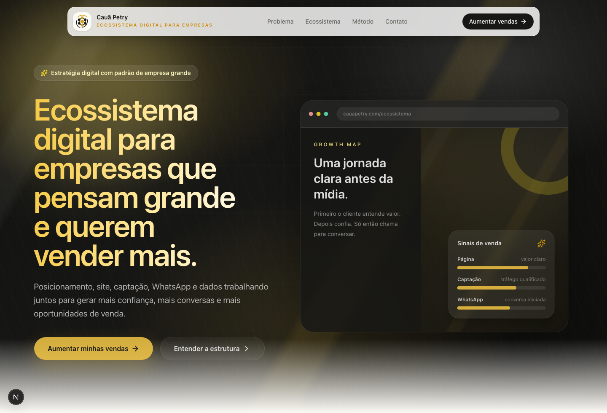
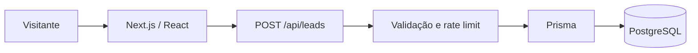

# Cauã Petry — Portfólio e captação

Site full stack para apresentar serviços de produto e tecnologia, organizar projetos em estudos de caso e transformar visitas em oportunidades qualificadas.

[Acessar site publicado](https://caua-petry-site.vercel.app)



## Destaques

- Landing page responsiva com narrativa orientada à conversão.
- Animações, microinterações e navegação acessível.
- Diagnóstico comercial com validação e estados de erro.
- Route Handler para captura de leads.
- Persistência com Prisma e PostgreSQL.
- Limite de requisições, validação de origem e respostas sem detalhes internos.
- Cabeçalhos de segurança globais.
- Verificação responsiva com Playwright e CI no GitHub Actions.

## Arquitetura



## Stack

- Next.js 15 e React 19
- TypeScript e Tailwind CSS 4
- Framer Motion e GSAP
- Prisma e PostgreSQL
- Playwright
- GitHub Actions

## Executar localmente

```bash
npm ci
cp .env.example .env.local
npm run dev
```

Para persistir o formulário, configure `DATABASE_URL` e aplique o schema Prisma.

```bash
npx prisma db push
```

## Qualidade

```bash
npm run lint
npm run build
node scripts/verify-responsive.mjs http://localhost:3000
```

O workflow de CI executa instalação reproduzível, lint e build em cada push e pull request.

## Variáveis de ambiente

```text
DATABASE_URL
```

Credenciais reais permanecem fora do repositório. A publicação pode exibir a interface sem banco, mas o envio do formulário retorna um erro seguro até que `DATABASE_URL` seja configurada.

## Licença

Código publicado para avaliação de portfólio. Nenhuma licença de reutilização comercial é concedida neste momento.

---

Desenvolvido por [Cauã Petry](https://github.com/cauapetrytri-rgb).
